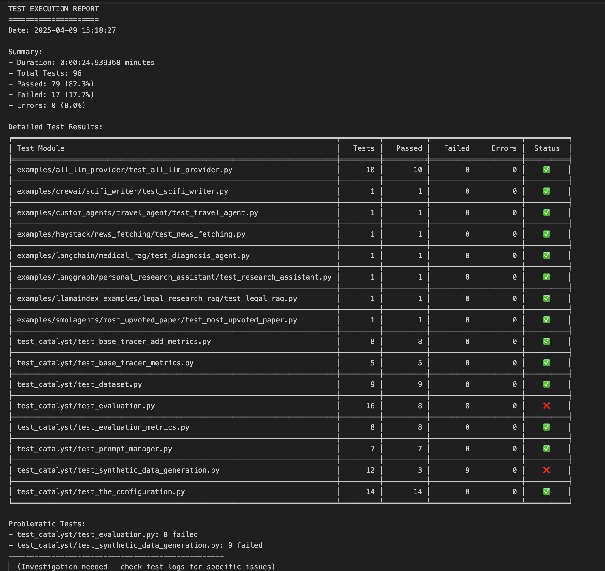

# RagaAI Catalyst Test Suite

**Description**  
This test suite validates the functionality of RagaAI Catalyst using pytest. It includes:
- Unit tests for core components
- Integration tests for key workflows
- Automated test reporting capabilities

## Setup Conda Environment

1. **Create the Conda environment** from the provided `environment.yml`:
   ```bash
   conda env create -f 'RagaAI-Catalyst/tests/environment.yml'

2. **Activate the environment:**
   ```bash
   conda activate ragaai_pytest_env  # Replace `ragaai_pytest_env` with the environment name from the YAML file

## Setup the Keys 
**Put these keys in the `.env` file**
```bash
#OpenAI
OPENAI_API_KEY=''

#Anthropic
ANTHROPIC_API_KEY=''

#Groq
GROQ_API_KEY=''

#Azure
AZURE_OPENAI_ENDPOINT=''
AZURE_OPENAI_API_KEY=''
AZURE_OPENAI_API_VERSION=''

#Google
GOOGLE_API_KEY=''

#Gemini
GEMINI_API_KEY=''

#Vertex AI Setup
PROJECT_NAME=''
LOCATION=''

# RagaAI
RAGAAI_CATALYST_BASE_URL=https://catalyst.raga.ai/api # use this url only
RAGAAI_CATALYST_ACCESS_KEY=''
RAGAAI_CATALYST_SECRET_KEY=''
RAGAAI_PROJECT_NAME=prompt_metric_dataset # use this dataset only
RAGAAI_DATASET_NAME=pytest_dataset

# Other APIs
TAVILY_API_KEY=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
SERPERDEV_API_KEY=12156d53ace04324ab935a67e356cce4c9984a84
```


## Running Tests

1. **Run Tests Individually with Pytest**
    Execute tests one by one and visualize pass/fail/error status:
    ```bash
    python -m pytest 'RagaAI-Catalyst/tests'

2. **Run All Tests and Generate Report**
    To run all tests and generate a comprehensive report:
    ```bash
    python 'RagaAI-Catalyst/tests/run_pytest_and_print_and_save_results.py'

    


